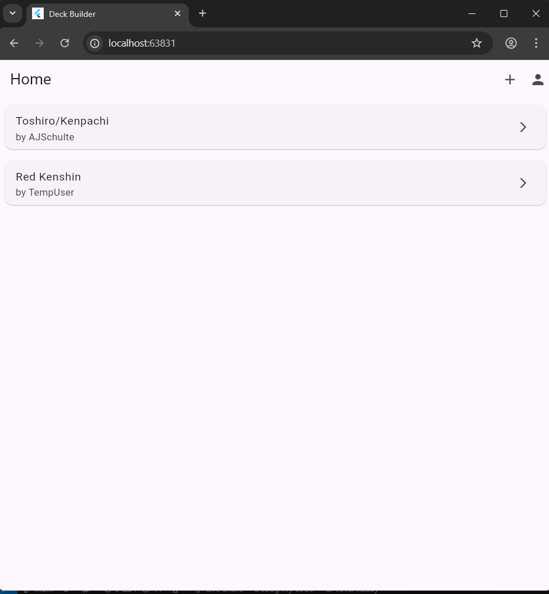
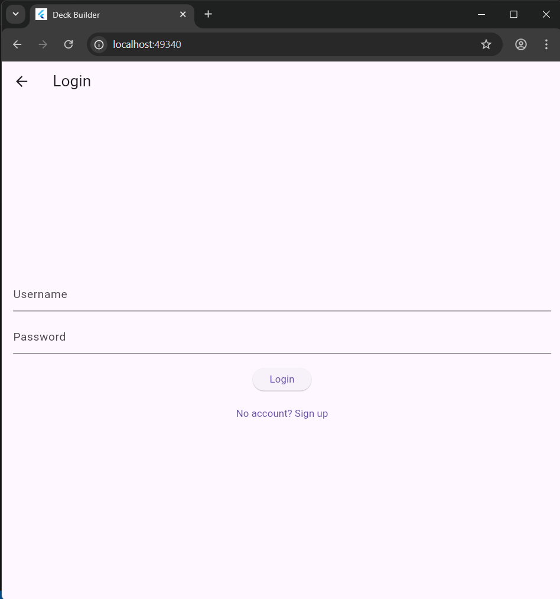

# Union Arena Deck Builder
## Sprint 1 Individual Project Report

**Cross-Platform Deck Builder for Union Arena TCG**

Cross-Platform Development – ASE456

---

Home Page

---

Card Grid View (Loaded from PocketBase)

---

Detailed Card View

---

Login / Sign Up UI

 

---

DeckBuilder View

---

1. **Sprint 1 Retrospective**
   - Project metrics: # of features, # of requirements, and burndown rate  
   - What Went Wrong/Well with Analysis & Improvement Plan

---

- **Number of individual features completed:** __2__  
- **Number of individual requirements completed:** __8__  
- **Individual burndown rate (%):** __40__  

---

### What Went Wrong (Individual Level):
- Initial MongoDB connection failed due to configuration issues  
- Needed to rewrite data layer after switching from API + MongoDB to PocketBase  

---

### What Went Well (Individual Level):
- Implemented authentication using email/password auth  
- Built a clean Flutter UI for card grid and detailed view  
- Implemented pagination and local caching for cards  

---

### Analysis & Improvement Plan (Individual Level):
- Fully transfer everything from API + MongoDb to PocketBase
- Improve User profile
- Research and implement a better way to get the cards

---

1. **Sprint 2 Goals**
   - What will you accomplish in Sprint 2  
   - Project metrics: # of features and # of requirements  
   - Updated timeline and milestones  

---

### Individual Sprint 2 Goals:

- Implement full Deck CRUD (Create, Read, Update, Delete)  
- Add card filtering and sorting (using PocketBase queries and local filters)  
- Add deck search
- Improve UI with responsive layout and dark/light theme  

---

### Individual Sprint 2 Metrics:

- **Number of individual features planned:** __3__  
- **Number of individual requirements planned:** __13__  

---

### Updated Individual Timeline:

- **Week 1:** Implement Deck CRUD and PocketBase relations  
- **Week 2:** Implement card filtering and sorting logic  
- **Week 3:** Add deck search 
- **Week 4:** UI/UX refinement, responsive design, dark/light mode  

---

### Key Individual Dates and Milestones:

- **Individual presentation:** During Sprint 2 (TBD)  
- **Individual milestones:**  
  - Deck CRUD functional → End of Week 1  
  - Card filters and sorting → End of Week 2  
  - Deck search and stats → End of Week 3  
  - Final UI/UX polish → End of Week 4  
